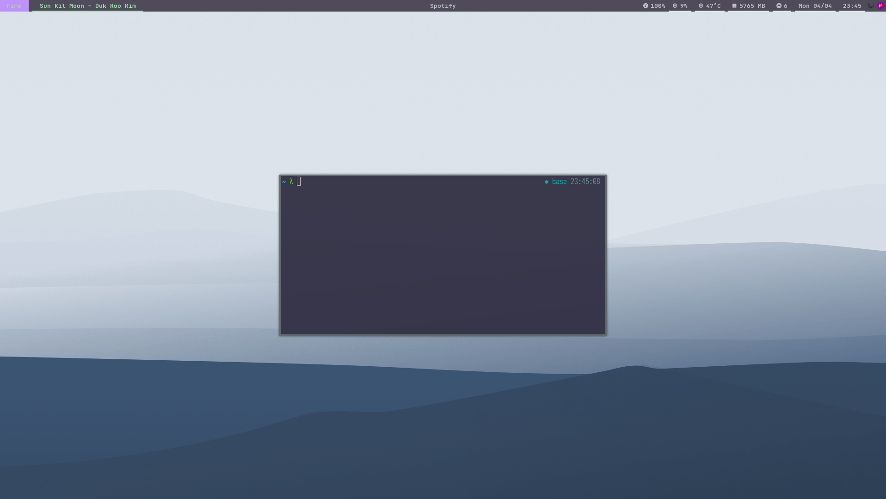

# ~/.

<p align="center"></p>

<p align="center">
Personal dotfiles for a streamlined, Unix-inspired, Arch-based development and productivity environment.
</p>

---

### 📦 Project Overview

This repository contains my full system configuration and tooling for a personalized, fast, and minimal Linux experience. It includes window manager settings, terminal utilities, shell enhancements, and custom scripts.

Built for:

- Tiling window management (i3)
- Terminal-based workflow
- Developer productivity
- Aesthetic yet lightweight UI
- Full control over system behavior

---

### 🚀 Installation

#### Clone the Repository

```sh
git clone git@github.com:joaopedroaats/dotfiles.git ~/dotfiles
```

**Warning:** This operation can overwrite existing files. Make sure to back up important data.

```sh
# This will perform a hard sync of your local config files with ~/dotfiles
sh ~/dotfiles/sync.sh
```

---

### 🛠️ Custom Commands

All binaries are located in `~/dotfiles/bin` and symlinked to `~/.local/bin`.

| Command  | Description |
|----------|-------------|
| `update` | Updates packages (`yay`, `doom`, `zinit`, etc.) |
| `status` | Prints system summary. Use `status -h` for help |
| `stot`   | Stow wrapper for easier dotfile management |
| `color`  | Terminal color test utility |
| `pass`   | Generates a 42-character secure password |
| `PATH`   | Displays `$PATH` in a readable format |
| `radio`  | Streams internet radio using `mpv` |

---

### 📁 Folder Structure

| Directory | Symlink Target | Purpose |
|----------|----------------|---------|
| `.config/` | `~/.config/` | App configurations |
| `bin/` | `~/.local/bin/` | Custom command-line utilities |
| `home/` | `~/` | Home directory overrides |
| `boot/` | `/boot/` | Bootloader resources |
| `etc/` | `/etc/` | System configuration |
| `srv/` | `/srv/` | Service data |
| `usr/` | `/usr/` | System-wide binaries |

---

### ⚙️ Configured Applications

All configuration files are stored in `.config/`.

- **i3** — Tiling window manager
- **picom** — Compositor for transparency
- **polybar** — Status bar
- **rofi** — App launcher and calculator
- **dunst** — Notification daemon
- **flameshot** — Screenshot tool
- **kitty** — Terminal emulator
- **doom emacs** — Emacs config for coding and writing
- **neovim** — Minimalist code editor
- **ranger** — Terminal file manager
- **zathura** — Document viewer
- **firefox** — Web browser
- **zsh** — Interactive shell

---

### 💻 Boot Manager

Custom `rEFInd` theme:

```sh
git clone git@gitlab.com:joaopedroaa/pers-rEFInd.git refind-theme
sudo cp -r refind-theme /boot/efi/EFI/refind/
```

---

### 🎨 Wallpapers

```sh
git clone git@gitlab.com:joaopedroaa/wallpapers.git ~/Pictures/Wallpapers/
```

Repo: [joaopedroaa/wallpapers](https://gitlab.com/joaopedroaa/wallpapers)

---

### 📦 Package List

```sh
git clone git@github.com:joaopedroaa/packages.git ~/packages
```

Repo: [joaopedroaa/packages](https://github.com/joaopedroaa/packages)

---

### 🧩 Zsh Plugins

Configured in `.config/zsh/plugins.zsh`:

- powerlevel10k
- zsh-autosuggestions
- zsh-syntax-highlighting
- zsh-history-substring-search
- zsh-completions
- fzf
- yarn-completion
- direnv
- docker/compose
- forgit
- oh-my-zsh: `sudo`, `fzf`, `bgnotify`

---

### ⚙️ Startup Routine

```sh
#!/bin/sh
xrandr --auto
nitrogen --restore &
flameshot &
nvidia-settings --load-config-only &
xmodmap $XDG_DOTFILES_DIR/.config/keyboard/.Xmodmap_dead_greek
```

---

### 🧪 Tips

- Use `stot` instead of `stow` for cleaner dotfile management.
- `radio` streams music directly from the terminal using `mpv`.
- `pass` generates secure random passwords on the fly.
