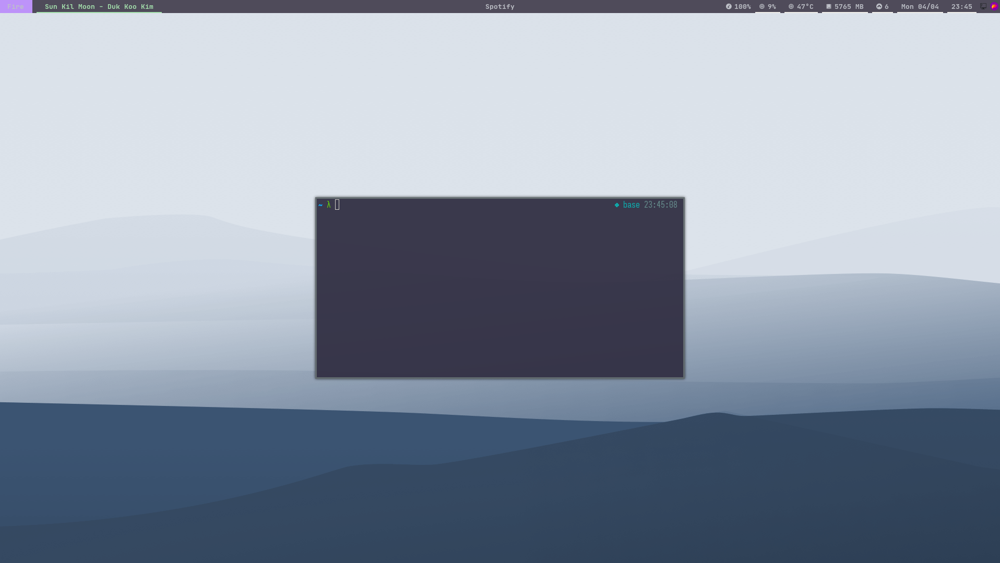

# ~/. (dotfiles)

<p align="center">
  
</p>

<p align="center">
  
  
  
  
  
</p>

<p align="center">
  <b>Configurações pessoais para um ambiente Unix-like otimizado, ágil e focado em produtividade.</b><br />
  Desenvolvido principalmente sobre o Arch Linux (com suporte básico para macOS usando Yabai/Skhd).
</p>

---

## Visão Geral

Este repositório reúne toda a configuração do meu sistema, incluindo o gerenciador de janelas (Window Manager), emuladores de terminal, editores de código e um conjunto diversificado de scripts utilitários desenvolvidos para automatizar tarefas cotidianas.

### Destaques
- **Gerenciamento de Janelas Dinâmico:** Configurações otimizadas para **i3** (Linux), **XMonad** (Linux) e **Yabai** (macOS).
- **Terminais Modernos:** Configurações prontas para **Kitty** e **Alacritty**.
- **Editores de Texto:** Setup completo do **Doom Emacs** e **Neovim** (Nvim) focados em desenvolvimento de software.
- **Sincronização Inteligente:** Utilização do `stot` (um wrapper personalizado para criação rápida de links simbólicos e cópias protegidas de arquivos de sistema).

---

## Instalação e Sincronização

> [!WARNING]
> A sincronização de arquivos pode sobrescrever configurações existentes em sua máquina. **Faça um backup prévio dos seus dados importantes antes de prosseguir!**

### 1. Clonar o Repositório
Para começar, clone o repositório na sua pasta pessoal (`HOME`):
```sh
git clone git@github.com:joaopedroaats/dotfiles.git ~/dotfiles
```

### 2. Primeira Inicialização
Execute o script de primeira sincronização. Ele criará o diretório de binários do usuário, configurará o link para a ferramenta `stot` e clonará o seu repositório de pacotes:
```sh
sh ~/dotfiles/first-sync.sh
```

### 3. Sincronizar Configurações
Você pode rodar a sincronização completa executando o script `sync.sh`:
```sh
# Sincronização geral (home, .config, etc, boot)
sh ~/dotfiles/sync.sh

# Sincronização incluindo arquivos do X11 (como xinitrc e xorg.conf)
sh ~/dotfiles/sync.sh x
```

No macOS, utilize o script de sincronização específico para macOS:
```sh
sh ~/dotfiles/syncm.sh
```

---

## Como funciona a sincronização (`stot`)

O coração do sincronismo é o script personalizado [stot](file:///home/joaopedro/dotfiles/bin/stot). Ele simplifica a criação de links simbólicos e cópias de arquivos do repositório para o sistema operacional local.

- **`stot -l <caminho>` (Link):** Cria um link simbólico de um arquivo/diretório do `~/dotfiles/` na sua pasta `$HOME/`. Se o destino não existir, o script cria a estrutura de diretórios necessária automaticamente.
- **`stot -c <caminho>` (Copy):** Copia arquivos para diretórios do sistema (como `/etc/` ou `/boot/`) usando `sudo cp`.

---

## Scripts Utilitários (`bin/`)

Todos os binários personalizados residem na pasta [bin/](file:///home/joaopedro/dotfiles/bin) e são linkados automaticamente para `~/.local/bin/` durante a sincronização.

| Comando | Descrição |
|:---|:---|
| [`stot`](file:///home/joaopedro/dotfiles/bin/stot) | Utilitário principal de sincronização (link e cópia rápida). |
| [`update`](file:///home/joaopedro/dotfiles/bin/update) | Atualiza pacotes do sistema de ponta a ponta (`pacman`, `yay`, `zinit` e tldr). |
| [`status`](file:///home/joaopedro/dotfiles/bin/status) | Exibe informações detalhadas de diagnóstico do sistema (disco, áudio, rede, locale, monitor, etc.). Use `status -h` para ver as flags. |
| [`radio`](file:///home/joaopedro/dotfiles/bin/radio) | Menu interativo via terminal para escutar rádios do Rio de Janeiro via streaming no `mpv`. |
| [`wallpaper`](file:///home/joaopedro/dotfiles/bin/wallpaper) | Define e executa um papel de parede de vídeo animado em setups de dois monitores utilizando `xwinwrap` e `mpv`. |
| [`wallpaper-convert`](file:///home/joaopedro/dotfiles/bin/wallpaper-convert) | Converte vídeos `.mp4` para `.webm` otimizados usando `ffmpeg` (ideal para o script de papel de parede). |
| [`pass`](file:///home/joaopedro/dotfiles/bin/pass) | Gera uma senha segura de 42 caracteres aleatórios, copia diretamente para o clipboard via `xsel` e a exibe no terminal. |
| [`ccl`](file:///home/joaopedro/dotfiles/bin/ccl) | Compila de forma rápida um arquivo C (`gcc`) e o executa imediatamente. |
| [`cclp`](file:///home/joaopedro/dotfiles/bin/cclp) | Compila de forma rápida um arquivo C++ (`g++` / stdc++) e o executa imediatamente. |
| [`PATH`](file:///home/joaopedro/dotfiles/bin/PATH) | Imprime cada diretório contido no seu `$PATH` em uma nova linha para facilitar a leitura. |
| [`color`](file:///home/joaopedro/dotfiles/bin/color) | Ferramenta visual para testar o suporte e esquema de cores ANSI do seu terminal. |
| [`systemctl-enable`](file:///home/joaopedro/dotfiles/bin/systemctl-enable) | Atalho rápido para habilitar, reiniciar e exibir o status de um serviço do `systemd`. |
| [`i3-layout-save`](file:///home/joaopedro/dotfiles/bin/i3-layout-save) | Salva o layout atual das janelas em uma workspace do i3 em formato `.json`. |
| [`i3load`](file:///home/joaopedro/dotfiles/bin/i3load) | Carrega um layout de workspace do i3 previamente salvo. |
| [`notify-test`](file:///home/joaopedro/dotfiles/bin/notify-test) | Dispara 5 notificações de teste seguidas no sistema para verificar o funcionamento do daemon de notificações. |
| [`git-remote`](file:///home/joaopedro/dotfiles/bin/git-remote) | Adiciona a URL do origin remoto e faz o push inicial da branch `main`. |
| [`gpt-import`](file:///home/joaopedro/dotfiles/bin/gpt-import) | Atalho rápido para importar chaves públicas de GPG a partir do keyserver. |
| [`hdln`](file:///home/joaopedro/dotfiles/bin/hdln) | Script de apoio interno que ajuda a criar diretórios e links para armazenamento local. |

---

## Estrutura do Repositório

| Diretório / Arquivo | Destino Principal | Função |
|:---|:---|:---|
| [`.config/`](file:///home/joaopedro/dotfiles/.config) | `~/.config/` | Configurações locais de aplicações e ambientes gráficos. |
| [`bin/`](file:///home/joaopedro/dotfiles/bin) | `~/.local/bin/` | Coleção de scripts utilitários do shell. |
| [`home/`](file:///home/joaopedro/dotfiles/home) | `~/` | Arquivos dotfiles do usuário (`.zshrc`, `.bashrc`, `.Xresources`, `.xprofile`, etc.). |
| [`boot/`](file:///home/joaopedro/dotfiles/boot) | `/boot/` | Temas e arquivos de configuração para o gerenciador de boot (rEFInd). |
| [`etc/`](file:///home/joaopedro/dotfiles/etc) | `/etc/` | Configurações globais de sistema (pacman, pulse, lightdm, php, network, hosts). |
| [`usr/`](file:///home/joaopedro/dotfiles/usr) | `/usr/` | Scripts e regras globais do sistema. |
| [`srv/`](file:///home/joaopedro/dotfiles/srv) | `/srv/` | Dados hospedados localmente para desenvolvimento web (`httpd`). |
| [`sync.sh`](file:///home/joaopedro/dotfiles/sync.sh) | - | Script principal para sincronização e setup local no Linux. |
| [`syncm.sh`](file:///home/joaopedro/dotfiles/syncm.sh) | - | Script principal para sincronização e setup local no macOS. |

---

## Aplicações Configuradas

As configurações completas para estes softwares encontram-se dentro de `.config/`:

- **Gerenciadores de Janela (WM):** **i3-gaps** (Linux), **XMonad** (Linux), **Yabai** (macOS)
- **Painéis / Statusbars:** **Polybar** (Linux), **i3blocks** (Linux), **Sketchybar** (macOS)
- **Barra de Atalhos e Teclado (macOS):** **Skhd** e **Borders**
- **Composição Gráfica:** **Picom** (transparência e transições)
- **Menu e Lançadores:** **Rofi** (aplicativos, cálculos)
- **Terminais:** **Kitty** e **Alacritty**
- **Editores:** **Doom Emacs** (desenvolvimento geral, Org-mode), **Neovim** (código ágil e leve)
- **Visualização de Arquivos:** **Ranger** e **LF** (gerenciadores de arquivo em terminal), **Zathura** (leitor de PDFs leve)
- **Interface e Áudio:** **Dunst** (notificações), **Flameshot** (capturas de tela), **Cava** (visualizador de áudio)
- **Browsers & Web:** **Firefox** (otimização via `user.js`)
- **Shell & Terminal:** **Zsh** gerenciado com **Zinit** (carregamento assíncrono Turbo) e tema **Powerlevel10k**. Otimizado com carregamento tardio (*lazy loading*) para NVM (inicialização do terminal ~5x mais rápida) e visualização enriquecida no completamento via **fzf-tab**.

---

## Aliases e Funções Úteis no Zsh

Abaixo estão alguns dos atalhos mais úteis configurados em [aliases.zsh](file:///home/joaopedro/dotfiles/.config/zsh/aliases.zsh):

### Manutenção e Otimizações
- **`clean`:** Realiza uma limpeza profunda no sistema (remove pacotes órfãos do `pacman`, limpa cache do `pacman` mantendo apenas as 3 versões mais recentes, e limpa completamente o cache do `yay`).
- **`reload`:** reconstrói o cache de fontes (`fc-cache`), atualiza o cache de ícones do sistema (`gtk-update-icon-cache`), atualiza o banco de dados do desktop/MIME e o banco de dados do manual (`mandb`).
- **`up` / `yaup`:** Atalho rápido para rodar atualizações de pacotes.

### Sistema e Utilidades
- **`soon`:** Bloqueia a tela e suspende a máquina (`i3lock` + `systemctl suspend`).
- **`game`:** Desativa temporariamente o `picom` para liberar mais performance gráfica em jogos.
- **`dots` / `packs`:** Abre o repositório de dotfiles ou de pacotes diretamente no VS Code.
- **`la` / `ls` / `lt`:** Atalhos para o comando `eza` para listar arquivos de maneira legível e com ícones.
- **`ipconfig`:** Retorna rapidamente seus endereços de IP interno e externo.
- **`sizes`:** Lista os 10 maiores arquivos/diretórios ocultos no seu diretório `HOME`.

---

## Recursos Especiais e Otimizações

O setup do Zsh conta com otimizações avançadas de desempenho e usabilidade:

- **Lazy Loading de NVM:** O carregamento do Node Version Manager (NVM) é postergado até que você execute comandos do Node (`nvm`, `node`, `npm`, `npx` ou `yarn`). Isso reduziu o tempo de inicialização do Zsh de ~0.8s para **~0.18s** (cerca de 5x mais rápido).
- **Previews Interativos com `fzf-tab`:** Ao usar a completação com a tecla `Tab`, o terminal exibirá janelas de pré-visualização interativas:
  - `cd <Tab>` exibe o conteúdo das pastas usando o `eza`.
  - `cat`/`bat`/`nvim`/`code` `<Tab>` exibe uma prévia do arquivo usando o `bat` com destaque de sintaxe e numeração de linhas.
- **Prevenção de Duplicados no PATH:** As variáveis `$PATH` e `$fpath` são sanitizadas automaticamente no início do shell para evitar caminhos duplicados ao abrir novos sub-shells.
- **Usabilidade de Histórico:**
  - Comandos que iniciam com um caractere de espaço em branco não são salvos no histórico (ideal para senhas).
  - Expansões automáticas de histórico como `!!` e `!$` exigem confirmação do botão `Enter` antes de executar.
  - Navegação automática `AUTO_CD`: digitar o caminho de um diretório existente realiza o `cd` diretamente.

---

## Temas e Repositórios Adicionais

- **Boot Manager (`rEFInd`):** Para usar o tema rEFInd configurado, clone e configure:
  ```sh
  git clone git@gitlab.com:joaopedroaa/pers-rEFInd.git refind-theme
  sudo cp -r refind-theme /boot/efi/EFI/refind/
  ```
- **Papéis de Parede:** Coleção de imagens e vídeos:
  ```sh
  git clone git@gitlab.com:joaopedroaa/wallpapers.git ~/Pictures/Wallpapers/
  ```
- **Repositório de Pacotes:** Lista de pacotes instalados no sistema:
  ```sh
  git clone git@github.com:joaopedroaa/packages.git ~/packages
  ```
